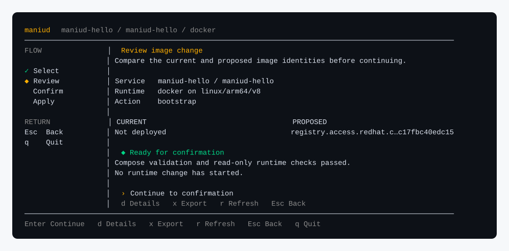

# maniud

[](https://github.com/IceCodeNew/maniud/actions/workflows/checks.yml?query=branch%3Amaster)
[](https://codecov.io/gh/IceCodeNew/maniud)
[](https://github.com/IceCodeNew/maniud/releases)
[](https://github.com/IceCodeNew/maniud/releases)

[English](README.md) | [简体中文](README.zh-CN.md)

maniud turns a container image or a published `docker run` command into a reviewable Compose file. It prepares required host paths, previews changes, applies upgrades, and resumes interrupted operations. Docker, Podman, and containerd are supported.

## Two-minute start

You need [maniud installed](docs/release-verification.md#install-a-verified-release-with-github-cli), Git, and a running Docker Engine. The example uses a public image pinned to a multi-platform digest, so the image identity stays fixed on Linux AMD64 and ARM64 hosts.

```sh
image='registry.access.redhat.com/ubi9/ubi-micro@sha256:990002083442f6a93cd3249da32ecb7c3f6be778a1bec3a73a9c17fbc40edc15'
docker pull "$image"
maniud tui
```

On the first screen, accept or edit the desired-state repository path, then confirm its creation. Choose **Add service** and paste this command:

```text
docker run --name maniud-hello --restart unless-stopped registry.access.redhat.com/ubi9/ubi-micro@sha256:990002083442f6a93cd3249da32ecb7c3f6be778a1bec3a73a9c17fbc40edc15 /usr/bin/sleep infinity
```

`maniud` parses the command without running it. Review the generated Compose file and staged diff. Every confirmation starts on **Back**; use Tab to select the effect before pressing Enter. After the commit, `maniud` reloads the committed file and performs a dry run before it offers **Apply**.



The [TUI guide](docs/tui.md) covers the complete flow, keyboard controls, terminal requirements, and recovery behavior. The [release verification guide](docs/release-verification.md) covers provenance-checked installation.

## Install

An agent that can operate the target machine can install the latest release with this prompt:

```text
Install the latest stable maniud release from https://github.com/IceCodeNew/maniud.
Follow docs/release-verification.md to select and verify the release file.
Install it into a user-writable directory on PATH, then run maniud --version.
Stop if verification fails. Do not change unrelated files.
```

The [release verification guide](docs/release-verification.md) also contains manual download and verification commands. Users of [mise](https://mise.jdx.dev/) can run:

```sh
mise use --global 'github:IceCodeNew/maniud[asset_pattern=maniud_{{ version }}_{{ os(macos="darwin") }}_{{ arch(x64="amd64") }},bin=maniud]@latest'
maniud --version
```

## Use non-interactive commands

Create a Git-backed service directory:

```sh
maniud gitops init "$HOME/maniud-desired-state"
cd "$HOME/maniud-desired-state/services"
```

Pull a fixed image version, then pass the upstream startup command to `gen`:

```sh
docker pull registry.example.com/team/photos:1.4.2
maniud gen -- docker run --name photos --restart unless-stopped \
  --mount type=bind,src=/srv/photos,dst=/var/lib/photos \
  registry.example.com/team/photos:1.4.2
```

When the project provides no startup command, generate from the local image instead:

```sh
maniud gen docker://registry.example.com/team/photos:1.4.2
```

The same form accepts `podman://` and `containerd://`. Use a fixed version instead of `latest` so each change can be reviewed and rolled back.

Review the generated Compose file. If `gen` also creates a `.prepare.sh` file, review every path and account before running it with the required privileges. Then commit the generated files:

```sh
cat photos.yaml
cat photos.prepare.sh
sudo sh photos.prepare.sh
git add photos.yaml photos.prepare.sh
git commit -m 'Add photos service'
```

Preview the operation, then apply the same file:

```sh
maniud apply --dry-run photos.yaml
maniud apply photos.yaml
```

`apply` accepts committed Compose files from a clean Git worktree. A failed preview makes no runtime or state changes.

## Apply updates from Git

Push the desired-state repository to a private remote, then run the daemon under a service manager:

```sh
cd "$HOME/maniud-desired-state"
git remote add origin YOUR_REPOSITORY_URL
git push -u origin master
maniud daemon start --interval 300
```

The daemon checks the repository immediately and after each interval. To upgrade a service, change its fixed image version, review any changed preparation script, then commit and push the update.

## Notifications

Copy the settings needed from [`env.example`](env.example) into the process environment. Bark and Telegram can be enabled at the same time. Notification delivery failures are reported separately and do not change an operation result.

## Recover an interrupted operation

Keep the Compose file, state directory, runtime workload, and backups unchanged. Run the same `apply` again, or restart the supervised daemon. Read the [recovery guide](docs/recovery.md) before editing state or backups.

Use `maniud COMMAND --help` for command syntax and the [error reference](docs/errors.md) for failure codes. The [custom build guide](docs/custom-builds.md) explains how to create a binary with selected runtimes.
